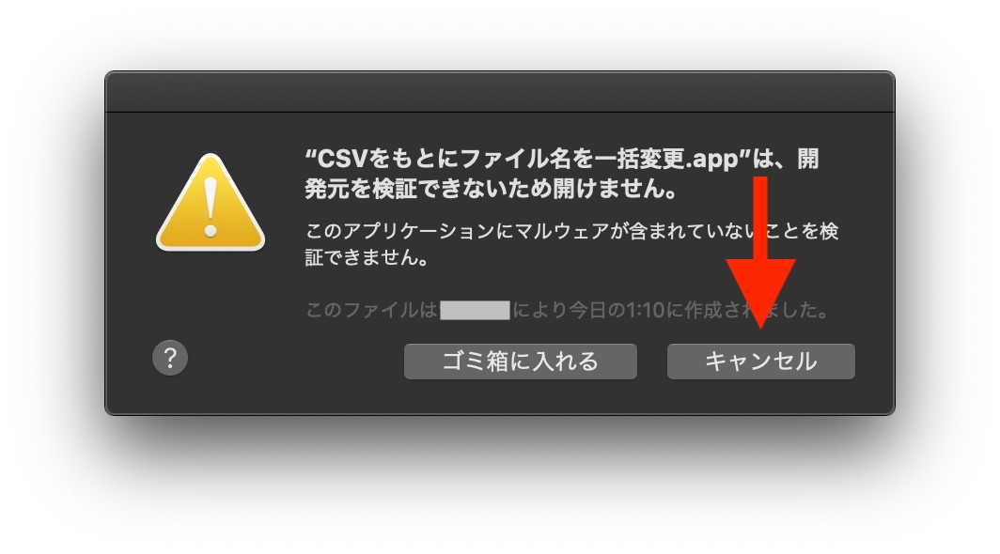
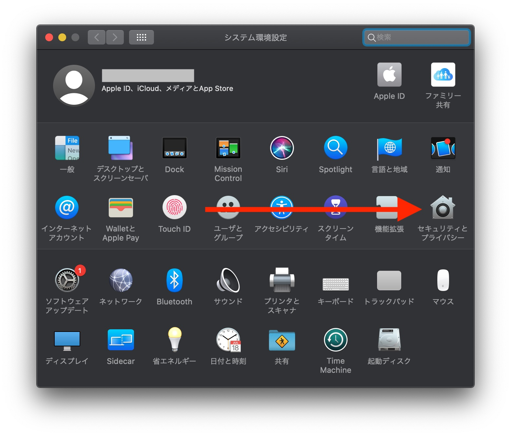
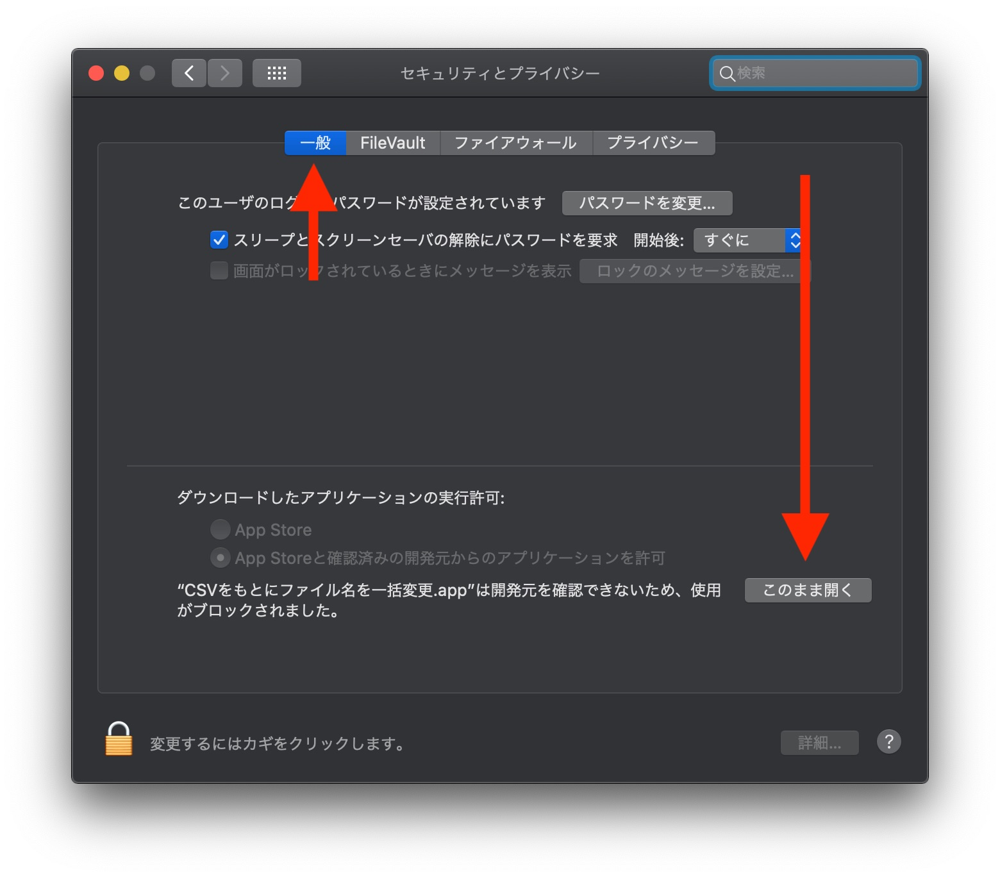
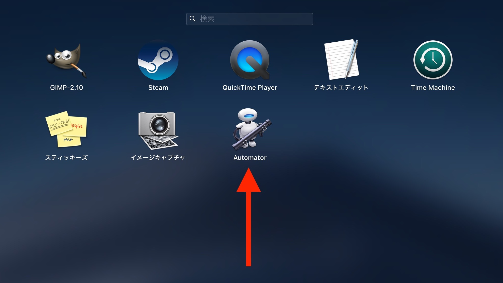

# CSVから一括でファイル名を変更するアプリ for macOS

**ダウンロードは[こちら](https://github.com/tippy3/cp-based-on-csv/raw/master/%E3%83%95%E3%82%A1%E3%82%A4%E3%83%AB%E5%90%8D%E3%82%92%E4%B8%80%E6%8B%AC%E5%A4%89%E6%9B%B4.zip)**

## 使い方
### 1. 対象にするファイルを1つのフォルダにまとめる
### 2. CSVファイルを作る

`変更前のファイル名,変更後のファイル名`というCSVファイルを作る。**変更前のファイル名と変更後のファイル名は英数字のみ可。スペースを含まないようにする。**

（例）rename.csv

```csv
image0001.jpg,dog.jpg
image0002.jpg,cat.jpg
image0003.jpg,bird.jpg
image0004.jpg,zebra.jpg
image0005.jpg,bear.jpg
```

ExcelやGoogleスプレッドシートに以下のような表を作り、CSVとして保存するのがオススメ。**※余計な行・列は作らないこと**

|               |           |
|---------------|-----------|
| image0001.jpg | dog.jpg   |
| image0002.jpg | cat.jpg   |
| image0003.jpg | bird.jpg  |
| image0004.jpg | zebra.jpg |
| image0005.jpg | bear.jpg  |

### 3. アプリを起動し、画面に従う
CSVファイルを選択 → フォルダを選択 の順番です。

## 初回起動時のセキュリティ警告
初回起動時は以下の警告が出る

### 1. 一度「キャンセル」をクリック



### 2. システム環境設定 → セキュリティとプライバシー



### 3. 「一般」タブの「このまま開く」



## このアプリについて

Qiitaに詳細を投稿しています。

[CSVから一括でファイル名を変更するMacアプリを作った](https://qiita.com/tippy/items/6e7dfaefea0fbce9f3e8)

また、このアプリをAutomatorで開くことで、処理を自由にカスタマイズすることができます。




